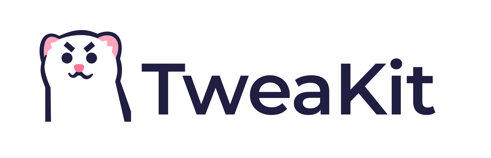

<p align="center">

</p>

TweaKit, a.k.a. "Tweak It", is a pure-swift library for adjusting parameters and feature flagging.

## Features

- Declare tweaks with property wrapper and result builder.
- Tweak frequently used types without effect.
- Tweak with carefully designed UI.
- Search tweaks fuzzily.
- Import and export tweaks with json.

## Requirements

- iOS 13 and later
- Swift 5.4 and later

## Installation

### CocoaPods

```ruby
pod 'TweaKit'
```

### Carthage

```ogdl
github 'sundayfun/TweaKit'
```

### Swift Package Manager

```swift
dependencies: [
    .package(url: "https://github.com/sundayfun/TweaKit.git", .branch("master"))
]
```

## Get Started

TBD // Please check the demo app for now.

## Credits

- All design work is done by [@愉悦地瓜](https://twitter.com/gggeeeeggge).
- TweaKit is heavily inspired by [SwiftTweak](https://github.com/Khan/SwiftTweaks).

## About The Logo

The logo of TweaKit is a cute stoat, a mustelid that can tweak fur color during summer and winter.
